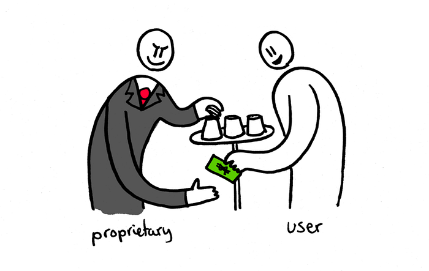

+++
title = "The Notion of Free Software for Beginners"
date = 2020-02-27T19:44:47.997Z
tldr = """
Free software provides freedom and privacy, makes software
production more efficient, advances technologies faster. Watch the
presentation by Stallman, which contains gist of the article.
"""
tags = ["free-software", "linux", "ethics", "english"]
slug = "notion-of-free-software-for-beginners"
+++

About more than a year ago, I needed to write an argumentative &  _academic_ 
research paper for my course. There was no subject restriction, so I chose to
contrast free software with proprietary software. Now, this was a bit problem
for me because my professor doesn’t have any interest in computers at all.
I agree that this subject was too specific for such assignment. The expected
topics were quite generic: "_Social media: Bad or good?_" , "_Veganism: Yes or
no?_", "_Vaccines: Safe or not?_" (Don’t panic! They always defend that it is
safe) and so on. Due to this expectation, I went the safe way and organized the
paper so that a person with no tech related knowledge on the field could 
understand it easily.

For those  _tech guys_  reading this, you may find several instances of
non-valid assertions in this article (especially the explicit instances given),
and you **are** right. Please don’t be too harsh on me (especially Apple users).
**I’m trying to prove a point to a non-tech user**, you may as well take it for
_the sake of example_.

This article (or whatever you call it) is centered around  [Stallman](https://stallman.org/)’s 
_strict_  ideas. So if you don’t like him, you may not really like this
article. I also admit, although I say that the article is based on his ideas,
it is really based on my interpretation of his ideas, so you may find that in
some cases I shrink or extend his ideas a bit. Today, I may not strictly
advocate some of the concepts given in the text. So I admit it has some flaws,
but I’m sure the message will be given and the notion will be fully understood.

If you find the article too exhaustive, you may instead watch this video where
Stallman describes free software. The article more or the less explains the 
same things with explicit examples. (I recommend watching it anyway because he
slams Microsoft real good):



> The original title for this article was **"An Overlooked Part of Human
> Freedom: Freedom of Software"**\
> I think it is too keen now, isn’t it?

---

The development in computer technology started to accelerate in the 1950s, when
World War II proved that computers had immense effects, specifically on mass
production and communication. For example, enigma machine, which was used to
convey encrypted military messages by Nazi Germany, provided substantial
amounts of information to be transmitted between the Axis powers before it was
deciphered by English computer scientist, mathematician and cryptanalyst Alan
Turing (Hodges, 1995).

Although it was possible to decipher such machines, it was a process of
enormous human effort and waste of time, and more advanced machines such as
Lorenz cipher took place of Enigma, impelling computer scientists to research
more advanced ways of automating computers to use them for decoding purposes.
This eventually led to the production of world’s first programmable, electronic
and digital computer (Hern, 2014).  Since then, computers have become
programmable devices, meaning that they perform tasks in a systematic and
hierarchical way, according to the specific variables and commands defined.

Programming languages are the means of defining variables and commands. A
computer program is a list of instructions defined by a programming language
to perform specific tasks such as addition and subtraction (Ferguson, 2004).
Emergence of programmable computers brought a new field in computer science:
software engineering. A software engineer is a person who develops programs
using programming languages to facilitate daily life.

From 1970s, this field started to gain more prominence and started to transform
into a commercial business; famous computer and software companies such as
Microsoft and Apple were founded in 1975 and 1976 respectively. At the time,
the competition was enormous in the market, as a result, companies started to
seek the philosopher’s stone in software development. This brought the reserved
mentality of programmers which blocked the distribution of source code
(instructions written using a programming language in a text format to execute
a program) of programs for fear that other companies would use their
technologies to excel theirs. There were also a minority of people who released
themselves from their companies for the cause of software development.

In 1983, Richard Stallman founded the free software (FS) movement by launching
the GNU Project[^1] (Stallman, 1983). The FS movement is a social movement which
maintains the idea that software should be free for the better development of
technologies, well-being of society, ease of usability and reliability.
Advocates of proprietary software (PS) assert that software should be regarded
as a product, each product should be sold for only one person, and the user of
the software should be aware of the possible restrictions that may be enforced
by the software company regarding use, distribution and modification of the
program. Some of the well-known PS includes Microsoft Windows, Adobe Photoshop
and Skype. On the contrary, FS philosophy encourages complete freedom.
Linux[^2], WordPress, Mozilla Firefox and Moodle are examples of FS.

When people think of PS, it is often thought that they only compose commercial
high-end programs, but a proprietary program may be free regarding price. To
ensure the distinction between PS and FS, Stallman proposed four essential
freedoms that make a program FS: *users should be able to run the program with
their free will for any purpose with no restrictions (freedom 0), users should
be able to study how the program works and they should be able to make
modifications as they wish (freedom 1), users should be able to redistribute
the program (freedom 2), users should be able to redistribute personally
modified version of the program (freedom 3)[^3] (Stallman, 2018). These four
freedoms define FS, and implicitly they necessitate it to be free of charge
and open source (source code which is publicly available to redistribute and
modify) because a program without source code is almost impossible to modify,
and an open source program can’t have any price due to its definition. There
are several aspects which make advocating FS movement more reasonable.

---

First and most significant one is the freedom it provides to its users. In
daily life, people want to be free. Even the slightest limitation on his or her
freedom makes a person feel uncomfortable, and people always prefer to choose
things that grant freedom: their government, living space, neighbors, friends
and even pets. Being free is certainly one of the most leading feeling in our
lives; it is one of the things that makes humans human. Although there is an
enormous effort put by people to gain absolute freedom, there are always some
restrictions on our life; we are not completely free. Some examples include
men’s compulsory military service, paying taxes for services which we don’t use
or benefit from, and not being able to travel across countries without lengthy
processes of acquiring visas and passports.

Although some cases vary from country to country, the lack of freedom in using
software is international. Software is everywhere in people’s lives, and it has
become an inseparable part of human life. Humans use software, because it
facilitates life, but the main problem is that we conform with the programs.
We do not use programs how we want, but instead we use them how they want.
PS companies do not give us the freedom to interact with programs, they
restrict our use of them by indicating the purposes of the use of them in their
licenses.

For example, Windows users constantly complain about the forced updates the
operating system (OS) enforces. Users turn on their computer to check their
emails or complete their important work, but they are obliged to wait for ten
minutes for the OS to finish its update. They don’t have the permission to skip
it and there is no option to disable updates. Furthermore, by downloading
updates in the background, this process sometimes slows down internet
connection while user is actively using the computer. Additionally, if a user
is not satisfied with the update, he or she can’t revert it even if it causes
critical system errors or the user doesn’t want to use new version for any
reason.

In this case, the user has no authority on the program; in fact, the program is
ruling the user by enforcing the updates. In case of FS, OSs do not enforce
anything; if there is an update available, the system asks the user if he or
she wants to update his system. When users are enforced by such restrictions,
they resort to third party software. For example, when Microsoft removed the
feature of start menu to introduce a new design called ‘Metro UI’ in Windows 8,
many users complained about the absence of start menu, and instead of using the
new design, many users downloaded third party software which brought back the
old start menu. Ironically, the most used program was ‘Classic Shell’, which is
FS (Whitney, 2012). As a result, Microsoft discontinued the idea of ‘Metro UI’
and reintroduced start menu with Windows 10.

In the end, users acquired what they wanted, but they wouldn’t have had to wait
for three years for the release of the new OS if they had used a free OS as
they would have had the right to choose which interface they wanted. Such
examples show that the freedom of software use is substantial.

---

The second aspect which makes FS superior is the pricing policy. Some people
think that purchasing computer software is a foolish idea; they assert that
computer programs are not tangible entities, they cost too much and some of
them even require lifetime payment. Even a person with this mentality pays
substantial amounts of money for software. Acquisition of PS is not only done
by the means of internet purchases. People buy software unconsciously, because
it is everywhere, and we need it.

For instance, famous technology company Apple has been manufacturing one of the
most popular smartphone series, which is ‘iPhone’. iPhone is so popular that,
in the United States, top ten most sold smartphones of 2018 include nine iPhone
models (Kielty, 2018). Although iPhone is one of the most expensive phone
series on the market, and it performs worse than its counterparts in terms of
battery life and overall hardware performance, it continues to be the most
dominant smartphone on the market. The reason is that the company values the
software of the smartphones; in fact, users may be paying money equivalent to
or more than the cost of the smartphone itself for software. The majority of 
the non-iPhone smartphones use a free OS, Android, which has the same
capabilities of iPhone’s OS, iOS.

In this case, people misinterpret the price of the product and purchase it
thinking that they are buying a capable smartphone, but instead; they spend the
majority of their money on an OS that they haven’t even heard the name of.
This is not the only case, computers also have OSs; the price of a computer
with Windows installed includes the cost of the OS. And more broadly, nearly
every electronic device has programs installed in it, including microwaves,
vacuum cleaners and refrigerators. Companies manufacturing these devices must
employ software engineers to produce software for them.

If FS was more widespread, companies could have used existing FS and people
wouldn’t have to pay for the extra costs of software production. By promoting
PS, companies only create redundant human work, waste of time and futile
expenses; and they compensate for expenses by charging customers more. Making
software free of charge has many economic benefits for people and companies,
but it also reduces competition by making the technology available for everyone
to use, therefore; companies need to think about whether they want to earn
more, or they want the goodness of society before promoting FS.

---

The third advantage that FS provides is the rapid development of technologies
in computer science; therefore, development in technologies that utilize
computers.

CERN is a European research organization, which is financed by European
governments. It hosts the largest particle physics laboratory in the world,
and since its foundation in 1954, major scientific achievements have been made,
including the introduction of the Internet. Anything discovered in CERN is
published as freely available information with the names of the participants
who helped in the process of discovery (Plasencia, 2017).

This concept of sharing information serves a crucial role in the development of
technologies, and that’s what FS movement demands. FS philosophers assert that
information should be available freely for everyone to use; otherwise, people
will have to discover technologies that are already in use, instead of
improving them. For example, 3D printing technology, which is used to produce
entire physical objects using hot plastic material was first introduced in the
1980s. 3D printing has become so popular that today, some people use 3D
printers as a household item, but until recently, they were not even aware of
the existence of the technology. One reason that made 3D printing prominent is
an open source movement that started in 2005.

Initiated by Dr. Adrian Bowyer, ‘RepRap Project’ had the aim of manufacturing
a 3D printer that could print its own parts to create a replica of itself.
The firmware of the project was released freely under the GNU General Public
License. With the emergence of RepRap printers, another open source project
emerged in 2011, "Marlin". As a result of these movements and contributions,
3D printing technology gained substantial pace in its development,
and many of the advanced 3D printers in use today are available because of
these movements (Flynt, 2017).

With the growing popularity of 3D printers, today, biologists and computer
scientists are attempting to produce human organs using 3D printers, and if
they succeed, FS will not only contribute to computer science, but also the
other professions.

On the contrary, PS companies do not follow the idea of free distribution of
technologies. In fact, they patent their software technologies, and they
prohibit other companies from using their technologies to become a monopoly.
However, programming is not like an art or an idea, one can argue that his or
her ideals should be used with his or her permission because he or she has the
ownership of it. But programmers must use existing patterns to develop useful
and effective software. In this case, programmers are restricted in such a way
that ultimately, it won’t be possible for them to produce beneficial products.

In an analogical way, a poet is not allowed to use a metaphor in his or her
text because that figure of speech was already patented by another poet.

Additionally, some PS companies may not even sell their products to some 
customers even if they want to buy. For example, Microsoft won’t sell any of
their products to people living in Cuba, Iran, North Korea and Syria because of
the government jurisdiction (“Exporting Microsoft Products FAQ”, 2018). And 
this is a great discrimination against people living in these countries because
companies as such use their economic power to become a monopoly. As a result,
people living in discriminated countries have to use other alternatives of the
programs. And this causes conflicts, for example, if a Syrian businessperson
wants to attend an online conference with managers living in foreign countries,
he or she will probably have to use Skype, which is a Microsoft product,
because it is the most popular program for the conferencing purposes worldwide.

This kind of problem can be solved by using FS, but it may take time for people
to get used to a new program and because of the discomfort, other users may
choose to expel Syrian people instead. Additionally, some of the popular
programs do not have alternatives, and people have to use them to perform
their job. For example, Adobe is a US company which is concentrated on graphic
design programs such as Photoshop. It is almost impossible for a person who has
no access to Photoshop to become a graphic designer. Some people have no
hostility for these people, but they have to comply with the discriminations
because they need to use products; if they don’t, they will have to stop using
them because of the license agreements. These instances show that monopoly
markets in software have detrimental effects.

> A typical user being hunted. Copyright 2014 Christian Noguera, Valentin
> Pasquier, Richard Stallman

---

The fourth aspect of FS concerns safety.

When programmers produce programs, they may make some design flaws, leading to
the emergence of software bugs, which make programs behave in unintended or
incorrect ways. When these kinds of bugs occur, they cause inconvenience for
users, and if the bug is a major one, it may even damage the computer hardware.
Software bugs can be exploited by crackers[^4], who are specialized in computers
to obtain information or make a profit by exploiting weaknesses of computer
systems. Acts of crackers may cause detrimental consequences. For example,
they may exploit banking systems, and transfer money into their accounts
illegally. They may also disable security cameras or alarm systems to help a
heist. When these possibilities are considered, it can be concluded that it is
vital for programmers to check their programs constantly for any potential
errors.

But programmers of PS are not always available to check their code because they
usually don’t work on weekends and holidays. For example, if a major software
bug emerges on a Friday night, users of the software may have to wait for two
days for programmers to fix the problem. In these two days, users of the
software may not carry out their work properly, and they may even suffer
financial loss. Furthermore, small companies of PS may take weeks or even
months to fix the problem because of the limited work force. In FS, a community
is responsible for programs, and it is difficult to implement a bug into a
program, as source code is always available and checked. Even a programmer
mistakenly inserts a faulty code into a program, it can be detected and fixed
immediately by other programmers. As FS programmers do not consider what they
are doing as a job, there are always people available to fix an error anytime.

PS programmers can also insert malicious code into their programs to use it for
their benefit, or they may not fix present unknown bugs to exploit them.
Because proprietary programs are developed by relatively small groups of
programmers, these malicious implementations may not be noticed by other
programmers. Apart from individual interests of programmers, companies may also
decide to insert malicious code into their programs as a marketing strategy.

For example, Apple acknowledged that their software updates slow down older
smartphones. Although the company asserts that these updates are intended to
protect the phone, most people interpret this as a strategy of impelling users
to buy newer versions of Apple smartphones (Kottasová, 2017). The act of
deliberate insertion of malicious code in FS is not possible because of the
open source principle.

---

The fifth aspect is related to information. It was mentioned that a PS product
may be free regarding price. It was also mentioned that PS programmers’ primary
purpose is earning money. This means that there must be a mechanism that allows
PS developers to earn money while distributing program free of charge.

In 2010, Lewis explained this mechanism by saying “If you are not paying for
it, you’re not the customer; you’re the product being sold.”.

Information and big data are precious elements of the 21st century because they
help companies find ways of manipulating society. By working on data sets,
companies are able to identify their target audience. After identifying their
audience, companies develop new marketing strategies accordingly. The simplest
form of this mechanism can be encountered in daily life. For example, if a
mother checks for some baby diapers on the internet, it will be noticed by the
shopping website that the user has a baby, and using this information, the
website may recommend the user baby clothes in the future.

Although this seems as a harmless action, there are many websites that save and
utilize more complicated information. In today’s world, social media is
responsible for big data. In general, people use social media for sharing their
life with their friends and family, but they also share their life with
companies. And by doing so, social media users give good clues for programmers
to use the data to reach bigger audiences and keep their present users.

For example, Pinterest introduced a design referred as “bottomless bowl” in
which users scroll down endlessly on their smartphones, and new content is
always available. After studying some data, it was found out by the behavioral
psychologists that this design impels users to see newly available content.
Today, many of the social media websites use this design to keep their users on
their smartphones.

Zynga, which is a game company, used their data to analyze users’ behavior to
find out when users are more inclined to spend money on their games. According
to the data, they adjusted the interface and mechanisms of the game to make
users spend more money (Edwards, 2018).

If people were offered to choose, they would certainly reject the idea of
collection of their information. Many people know that they are manipulated and
their information is obtained, but they are so addicted to the products that
they can’t quit using them. This proves that some programs rule people, but
not the free ones.

FS products regard users’ privacy. A free program may collect information for
developmental purposes, but users can always choose not to contribute. It was
mentioned that people purchase programs unconsciously, in the earlier case,
people lose their money, but in this case, people lose their privacy. In the
fourth aspect, it was mentioned that FS provides safety, and this can be
further supported in relation to privacy.

Companies have access to some sensitive data, these include users’ photographs,
credit card information, ID information, home addresses and conversations with
other people. When a software company fails to protect their collected
information from crackers, it may cause great discomfort in society; in fact,
it may even cause serious ethical issues.

In 2015, crackers stole all the customer data of Ashley Madison, which is an
extramarital affair website, and demanded that the website shut down. One of
their justifications for the act was that the website charged $19 for users to
completely delete their accounts including their sensitive information. By
adopting this policy, the company was able to net $1.7 million in revenue
in 2014. Stolen data included emails, names, home addresses and credit card
information.

Eventually, the website wasn’t shut down and all the data were published
publicly. After the incident, it was found out that the information of the
users who deleted their accounts by paying was never deleted. As a result, some
people attempted to blackmail their acquaintances who were registered on the
website, and two customers of the website were reported to commit suicide in
Canada (Baraniuk, Chideya, Thomsen & Cluley, 2015).

Similarly, in 2014, Apple’s cloud storage service iCloud was cracked, leading
to distribution of celebrities’ photos containing nudity (Arthur, 2014).

It can be concluded that by using PS, people are making themselves vulnerable
to cracking incidents. It should also be considered that the entire blame is
not on PS companies, as FS products may also be cracked. The emphasis is that
if FS becomes more available, it will be harder for crackers to conduct
fraudulent actions because programmers won’t make same design mistakes, and
they will develop new strategies to manage security problems using the
available source code and information. It is not exactly known what programing
errors caused iCloud and Ashley Madison incidents, except the developers
working in these companies because other programmers don’t have the access
to the code; and it can’t be guaranteed that same mistakes will not be repeated
by other PS companies; this is directly related to the role of FS in rapid
development of technologies.

----

In conclusion, it can be argued that there are five major benefits of
promoting FS: it provides freedom by not interfering with users, it makes
software production cheaper by reducing waste of resources, it encourages
further development of technologies by encouraging sharing, it provides proper
development of software by uniting programmers and provides privacy by letting
users what to share.

Choosing FS or PS is an ethical question. While FS has many benefits for
society, people tend to choose the continuation of PS because they have the
motivation of acquiring more money, which uncovers the self-centered mind of
humans. FS companies can earn adequate money, there are many jobs available
which utilize FS programmers. And people can donate money to FS programmers,
because they work for the goodness of society. Wikipedia is one example.
If people stop considering life as a contest of earning money, FS will replace
the place of PS, and it will certainly revolutionize our conception of
computers and our life.

## References

Arthur, C. (2014, September 1). Naked celebrity hack: security experts focus on iCloud backup theory. Retrieved from  [https://www.theguardian.com/technology/2014/sep/01/naked-celebrity-hack-icloud-backup-jennifer-lawrence](https://www.theguardian.com/technology/2014/sep/01/naked-celebrity-hack-icloud-backup-jennifer-lawrence)

Baraniuk, C. (2015, August 24). Ashley Madison: ‘Suicides’ over website hack. Retrieved from  [https://www.bbc.com/news/technology-34044506](https://www.bbc.com/news/technology-34044506)

Chideya, F. (2015, July 21). Ashley Madison Breach: Why Am I Getting Their Emails? Retrieved from  [https://theintercept.com/2015/07/21/ashley-madison-breach-why-am-i-getting-their-emails/](https://theintercept.com/2015/07/21/ashley-madison-breach-why-am-i-getting-their-emails/)

Cluley, G. (2015, December 14). Ashley Madison blackmailers now sending threats via US postal system. Retrieved from  [https://www.grahamcluley.com/ashley-madison-blackmailers-sending-threats-postal/](https://www.grahamcluley.com/ashley-madison-blackmailers-sending-threats-postal/)

Edwards, H. S. (2018, April). The Masters of Mind Control.  _TIME_, 191, p. 33.

Exporting Microsoft Products FAQ. (2018). Retrieved from  [https://www.microsoft.com/en-us/exporting/faq.aspx](https://www.microsoft.com/en-us/exporting/faq.aspx)

Ferguson, A. (2000). A History of Computer Programming Languages. Retrieved from  [https://cs.brown.edu/~adf/programming_languages.html](https://cs.brown.edu/~adf/programming_languages.html)

Hern, A. (2014, November 14). How did the Enigma machine work? Retrieved from  [https://www.theguardian.com/technology/2014/nov/14/how-did-enigma-machine-work-imitation-game](https://www.theguardian.com/technology/2014/nov/14/how-did-enigma-machine-work-imitation-game)

Hodges, A. (1995). Alan Turing — a short biography. Retrieved from  [https://www.turing.org.uk/publications/dnb.html](https://www.turing.org.uk/publications/dnb.html)

Kielty, J. (2018, October 18). The most popular smartphones in 2018. Retrieved from  [https://deviceatlas.com/blog/most-popular-smartphones](https://deviceatlas.com/blog/most-popular-smartphones)

Kottasová, I. (2017, December 21). Apple: Yes, we’re slowing down older iPhones. Retrieved from  [https://money.cnn.com/2017/12/21/technology/apple-slows-down-old-iphones/index.html?iid=EL](https://money.cnn.com/2017/12/21/technology/apple-slows-down-old-iphones/index.html?iid=EL)

Lewis, A. (2010, August 26). User-driven discontent. Retrieved from  [https://www.metafilter.com/95152/Userdriven-discontent#3256046](https://www.metafilter.com/95152/Userdriven-discontent#3256046)

Malkin, G. (1996). Internet Users’ Glossary. Retrieved from  [https://tools.ietf.org/html/rfc1983](https://tools.ietf.org/html/rfc1983)

Operating System Family / Linux. (2018). Retrieved from  [https://www.top500.org/statistics/details/osfam/1](https://www.top500.org/statistics/details/osfam/1)

Plasencia, A. (2017).  _Is the Universe a Hologram? Scientists Answer the Most Provocative Questions (p. 249)_. Cambridge, MA: The MIT Press.

Stallman, R. (1983, September 27). Free Unix! Retrieved from  [https://www.gnu.org/gnu/initial-announcement.html](https://www.gnu.org/gnu/initial-announcement.html)

Stallman, R. (1985). The GNU Manifesto. Retrieved from  [https://www.gnu.org/gnu/manifesto.en.html](https://www.gnu.org/gnu/manifesto.en.html)

Stallman, R. (2018). What is free software? Retrieved from  [https://www.gnu.org/philosophy/free-sw.html.en](https://www.gnu.org/philosophy/free-sw.html.en)

Thomsen, S. (2015, Jul 20). Extramarital affair website Ashley Madison has been hacked and attackers are threatening to leak data online. Retrieved from  [https://www.businessinsider.com/cheating-affair-website-ashley-madison-hacked-user-data-leaked-2015-7](https://www.businessinsider.com/cheating-affair-website-ashley-madison-hacked-user-data-leaked-2015-7)

Whitney, L. (2014, May 27). How to get the Start menu back in Windows 8. Retrieved from  [https://www.cnet.com/how-to/how-to-get-the-start-menu-back-in-windows-8/](https://www.cnet.com/how-to/how-to-get-the-start-menu-back-in-windows-8/)

[^1]: _GNU_  is a recursive acronym for “Gnu’s Not Unix”. A reference to Unix, which was a widely used closed source operating system at the time (Stallman, 1985).

[^2]: Linux is a free operating system kernel, which is used to develop operating systems. The most famous operating system that utilize Linux is Android, which is used by most of the smartphones. Linux also accounts for most of the web servers and embedded devices. Today, world's 500 most powerful supercomputers run Linux (“Operating System Family / Linux”, 2018).

[^3]: Initially, Stallman listed three rules, but he felt the need of appending a new one (freedom 0). Because this freedom was more basic than the other three, it was decided that the new rule should precede others, as a result, it was named freedom 0 (Stallman, 2018).

[^4]: Crackers are commonly known as ‘hackers’ in colloquial language, but in fact a hacker is a person who is interested in internal workings of computer systems. Any person who is delighted to study and understand computer systems can be called hacker, but not a cracker (Malkin, 1996).
